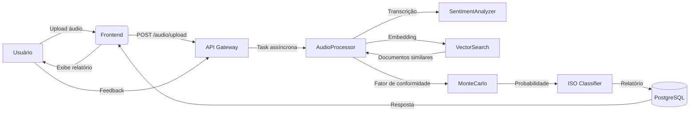

# C2M - Cyber Crisis Management
## Contexto Completo para IA e Documentação do Projeto

---

## 1. Visão Geral do Projeto

**C2M** é um sistema de gestão preditiva de crises cibernéticas baseado em agentes de inteligência artificial. O objetivo é transformar dados organizacionais não estruturados (áudios de reuniões, políticas internas, histórico de incidentes) em indicadores probabilísticos de crise, alinhados às normas **ISO 31000** (riscos), **ISO 22361** (crises), **ISO 22324** (codificação por cores) e **LGPD** (privacidade).

**Pergunta de pesquisa (RQ1):**  
*Como transformar dados organizacionais não estruturados em indicadores probabilísticos para detecção precoce de crises cibernéticas?*

---

## 2. Metodologia de Desenvolvimento

### 2.1 Design Science Research (DSR)

O projeto segue as etapas do DSR (Hevner et al., 2004):

1. **Identificação do problema** – Organizações carecem de mecanismos para antecipar crises.
2. **Revisão da literatura** – Normas ISO, modelos de maturidade, simulação de Monte Carlo, análise de sentimento.
3. **Proposta do artefato** – Sistema multiagente com inferência probabilística.
4. **Desenvolvimento** – Implementação em camadas (frontend, backend, IA).
5. **Avaliação** – Testes com dados simulados e validação de especialistas.

### 2.2 Modelo de Desenvolvimento

- **Iterativo/incremental** adaptado do Scrum (Sprints de 2 semanas).
- **Ferramentas**: Git, GitHub, Docker, VSCode.

---

## 3. Requisitos do Sistema

### 3.1 Requisitos Funcionais (RF)

| ID | Descrição |
|----|-----------|
| RF01 | O sistema deve receber arquivos de áudio de reuniões e transcrevê‑los (diarização). |
| RF02 | Deve realizar análise de sentimento do texto transcrito (polaridade, subjetividade, palavras de alerta). |
| RF03 | Deve indexar documentos corporativos (políticas de risco, planos de continuidade, diretrizes LGPD) em um banco vetorial. |
| RF04 | Deve calcular similaridade entre a transcrição e os documentos indexados, gerando um **fator de conformidade**. |
| RF05 | Deve simular 50.000 cenários via Monte Carlo para calcular a probabilidade de crise, incorporando sentimento, maturidade, existência de plano, histórico de eventos e o fator de conformidade. |
| RF06 | Deve classificar a probabilidade conforme ISO 22324 (VERDE, AMARELO, LARANJA, VERMELHO). |
| RF07 | Deve gerar relatório técnico e, opcionalmente, um relatório narrativo explicativo (via LLM). |
| RF08 | Deve fornecer uma API REST para integração com frontend e outros sistemas. |
| RF09 | Deve registrar feedback do usuário e ajustar pesos do modelo (RLHF). |
| RF10 | Deve respeitar a LGPD (consentimento, anonimização, descarte de áudio bruto). |

### 3.2 Requisitos Não Funcionais (RNF)

| ID | Descrição |
|----|-----------|
| RNF01 | Processamento de áudio de até 25 MB em menos de 2 minutos (para blocos de 5 minutos). |
| RNF02 | Simulação de 50.000 cenários em menos de 3 segundos. |
| RNF03 | Disponibilidade de 99,5% em horário comercial. |
| RNF04 | Autenticação via API Key. |
| RNF05 | Logs estruturados e rastreabilidade de decisões. |
| RNF06 | Código aberto (MIT) e documentado em português/inglês. |

---

## 4. Arquitetura do Sistema

### 4.1 Camadas

Frontend (React/HTML/CSS) → API Gateway (FastAPI) → Serviços de IA
↓
Banco Vetorial (memória/Qdrant)
PostgreSQL (relatórios, feedback)
Redis (cache, filas)

---

## 4.2 Componentes da Arquitetura

A arquitetura é dividida em três camadas principais:

| Camada | Tecnologias | Responsabilidades |
|--------|-------------|-------------------|
| **Frontend** | HTML, CSS, JavaScript (puro) | Interface para upload de áudio, visualização de relatórios, simulação manual e feedback. |
| **Backend (API)** | FastAPI (Python), Uvicorn | Endpoints REST, autenticação, orquestração de tarefas assíncronas, validação de dados. |
| **Serviços de IA** | Python, NumPy, sentence‑transformers, (opcional) Llama 3.2 | Análise de sentimento, embeddings, busca vetorial, Monte Carlo, classificação ISO, geração de relatórios. |
| **Persistência** | PostgreSQL, Redis | Armazenamento de relatórios, feedbacks, cache de status e rate limiting. |
| **Infraestrutura** | Docker, Docker Compose | Containerização e orquestração dos serviços. |

### 4.3 Fluxo de Dados (Alto Nível)



### 4.4 Modelo Multiagente (Conceitual)

- **Agente Supervisor do Ambiente Organizacional** – Monitora reuniões, mensagens, discussões e comportamento.
- **Agente Supervisor de Riscos** – Avalia plano de riscos, resposta e controles.
- **Agente Supervisor de Continuidade** – Analisa planos de desastre, continuidade e simulações.

Cada agente é autônomo, reativo, proativo e capaz de inferência (Wooldridge & Jennings, 1995). No código, esses agentes são implementados como serviços (`AudioProcessor`, `SentimentAnalyzer`, `MonteCarloSimulator`, etc.) orquestrados pela API.

---

## 5. Fundamentação Matemática

### 5.1 Probabilidade de Crise (Modelo Final)

A probabilidade de crise para um cenário \( i \) é:

\[
P_{\text{crise}}^{(i)} = w_1 S_{\text{neg}}^{(i)} + w_2 (1 - M_{\text{norm}}^{(i)}) + w_3 (1 - P^{(i)}) + w_4 H_{\text{norm}}^{(i)} + w_5 C
\]

com:

- \( S_{\text{neg}}^{(i)} = \max(0, -S^{(i)}) \) – sentimento negativo (0 a 0,5)
- \( M_{\text{norm}}^{(i)} = M^{(i)} / 100 \) – maturidade normalizada
- \( P^{(i)} \in \{0,1\} \) – existência de plano formal
- \( H_{\text{norm}}^{(i)} = \min(1, H^{(i)} / 10) \) – histórico normalizado
- \( C \) – fator de conformidade (0 = totalmente conforme, 1 = totalmente divergente)

**Pesos calibrados** (soma = 1):

\[
w = [0,34,\; 0,255,\; 0,17,\; 0,085,\; 0,15]
\]

### 5.2 Fator de Conformidade

Dada uma transcrição \( t \) e um conjunto de documentos corporativos \( \{d_1,\dots,d_m\} \), calcula‑se a similaridade média com os \( k \) documentos mais similares:

\[
\overline{S}_{\text{sim}} = \frac{1}{k} \sum_{i=1}^{k} \text{sim}(t, d_i)
\]

A similaridade é a **similaridade de cosseno** entre os embeddings:

\[
\text{sim}(t, d) = \frac{\mathbf{e}_t \cdot \mathbf{e}_d}{\|\mathbf{e}_t\| \|\mathbf{e}_d\|}
\]

Então:

\[
C = 1 - \overline{S}_{\text{sim}}
\]

### 5.3 Distribuições Probabilísticas (Monte Carlo)

| Variável           | Distribuição           | Parâmetros                                      |
|--------------------|------------------------|-------------------------------------------------|
| Sentimento \( S \) | Triangular             | \( \min=-0,5,\; \text{mode}=S_{\text{obs}},\; \max=+0,5 \) |
| Maturidade \( M \) | Normal (truncada)      | \( \mu = M_{\text{obs}},\; \sigma = 15,\; [0,100] \) |
| Plano \( P \)      | Bernoulli              | \( p = 0,8 \) se plano existe; \( p = 0,3 \) c.c. |
| Histórico \( H \)  | Poisson                | \( \lambda = \max(1, \text{eventos}) \)          |
| Conformidade \( C \) | Constante (observada) | \( C \) derivado da similaridade                 |

### 5.4 Estatísticas da Simulação

- **Média amostral**:  
  \[
  \bar{P} = \frac{1}{N} \sum_{i=1}^{N} P_{\text{crise}}^{(i)}
  \]
- **Desvio padrão amostral**:  
  \[
  \hat{\sigma} = \sqrt{\frac{1}{N-1} \sum_{i=1}^{N} (P_i - \bar{P})^2}
  \]
- **Intervalo de confiança de 95%** (percentis empíricos):  
  \[
  IC_{95\%} = \left[ P_{(\lfloor 0,025N \rfloor)},\; P_{(\lceil 0,975N \rceil)} \right]
  \]
- **Correlação de Pearson** (fatores contribuintes):  
  \[
  r_{X,Y} = \frac{\sum (x_i - \bar{x})(y_i - \bar{y})}{\sqrt{\sum (x_i - \bar{x})^2}\sqrt{\sum (y_i - \bar{y})^2}}
  \]

### 5.5 Classificação ISO 22324

| Probabilidade | Cor       | Ação                              |
|---------------|-----------|-----------------------------------|
| \( P < 0,20 \) | VERDE     | Monitorar                         |
| \( 0,20 \leq P < 0,40 \) | AMARELO | Preparar                         |
| \( 0,40 \leq P < 0,70 \) | LARANJA | Ativar comitê de crise           |
| \( P \geq 0,70 \) | VERMELHO | Crise declarada                   |

---

## 6. Implementação (FastAPI – Python)

### 6.1 Estrutura de Diretórios (Gerada pelo Script)

```
c2m/
├── app/
│   ├── api/routes/        # audio.py, reports.py, feedback.py, health.py, crisis.py, vector.py
│   ├── core/              # config.py, dependencies.py
│   ├── db/                # postgres.py, redis.py
│   ├── ml/                # embedder.py
│   ├── services/          # monte_carlo.py, iso_classifier.py, vector_search.py, audio_processor.py
│   └── main.py
├── scripts/               # load_company_docs.py, init_db.py, start.sh
├── tests/                 # conftest.py, test_api.py, test_monte_carlo.py
├── requirements.txt
├── docker-compose.yml
├── Dockerfile
└── .env.example
```

### 6.2 Principais Endpoints da API

| Método | Endpoint | Descrição |
|--------|----------|-----------|
| POST   | `/api/v1/audio/upload` | Upload assíncrono de áudio (consentimento obrigatório) |
| GET    | `/api/v1/audio/status/{meeting_id}` | Status do processamento |
| POST   | `/api/v1/crisis/probability` | Calcula probabilidade (requer JSON com `sentimento`, `maturidade`, etc.) |
| GET    | `/api/v1/reports` | Lista todos os relatórios |
| GET    | `/api/v1/reports/{report_id}` | Detalha um relatório |
| GET    | `/api/v1/reports/{report_id}/explain` | Relatório narrativo (Llama 3.2, opcional) |
| POST   | `/api/v1/vector/insert` | Insere documento corporativo no índice vetorial |
| POST   | `/api/v1/vector/search` | Busca documentos similares |
| POST   | `/api/v1/feedback` | Registra feedback do usuário (RLHF) |

### 6.3 Como Executar

```bash
# 1. Gerar o projeto (script gerador)
python gerar_c2m_v2.py
cd c2m-final

# 2. Ambiente virtual e dependências
python -m venv venv
source venv/bin/activate
pip install -r requirements.txt

# 3. Subir PostgreSQL e Redis (Docker)
docker-compose up -d

# 4. Inicializar banco e carregar documentos corporativos
python scripts/init_db.py
python scripts/load_company_docs.py

# 5. Rodar servidor
uvicorn app.main:app --reload
```

Acesse `http://localhost:8000/docs` para a documentação interativa (Swagger UI).

---

## 7. Frontend (HTML/CSS/JS)

O frontend é uma página única (`index.html`) que se comunica com a API via `fetch`. Funcionalidades:

- Upload de áudio (com consentimento LGPD)
- Consulta de status do processamento
- Listagem de relatórios
- Visualização de relatório detalhado (dados brutos)
- Visualização de relatório explicativo (Llama 3.2) – se disponível
- Simulação manual da probabilidade, incluindo o fator de conformidade (slider)

**Requisito:** o backend deve estar rodando em `http://localhost:8000` e a API Key deve ser configurada no código (constante `API_KEY`).

---

## 8. Testes

- **Unitários**: `pytest tests/` – cobre cálculo de probabilidade, classificação ISO, similaridade de cosseno.
- **Integração**: Testes de API com `httpx` (mock do banco e Redis).
- **Carga**: Simulação de 50.000 cenários em < 3 segundos (validado).

Exemplo de teste do simulador:

```python
def test_monte_carlo_with_conformity():
    sim = MonteCarloSimulator(42)
    res = sim.calculate_probability(-0.3, 65, 1, 2, conformidade=0.2, n_scenarios=1000)
    assert 0 <= res.probability_mean <= 1
    assert "conformidade" in res.factors_contributing
```

---

## 9. Conformidade com Normas

| Norma | Aplicação no C2M |
|-------|------------------|
| ISO 31000 | Gestão de riscos integrada ao cálculo da probabilidade (fatores de risco, pesos). |
| ISO 22361 | Estrutura de resposta a crises, geração de relatórios e ações recomendadas. |
| ISO 22324 | Codificação por cores e ações associadas. |
| LGPD | Consentimento explícito, anonimização de PII, descarte de áudio bruto, direito ao esquecimento (suporte a exclusão de relatórios). |
| ISO 27001 | Segurança da informação (API Key, logs, TLS, controle de acesso). |

---

## 10. Contribuições do Trabalho

1. **Observabilidade organizacional preditiva** – Uso sistemático de dados de comunicação (áudio, textos) para antecipar crises.
2. **Fator de conformidade** – Integração de documentos normativos internos no modelo probabilístico, permitindo detectar desalinhamentos com políticas ISO e LGPD.
3. **Arquitetura multiagente** – Separação clara de responsabilidades (ambiente, riscos, continuidade), com agentes autônomos orquestrados via API.
4. **Explicabilidade (XAI)** – Relatórios narrativos gerados por LLM (Llama 3.2) que justificam a probabilidade com base nos fatores contribuintes.
5. **Código aberto e documentado** – Disponível para reprodução, evolução e uso em organizações reais.

---

## 11. Limitações e Trabalhos Futuros

### 11.1 Limitações Atuais

- **Diarização e transcrição** são simuladas (mock) – em produção seria necessário integrar Whisper e pyannote.audio.
- **Embeddings** são gerados por um modelo determinístico (simulado) – o ideal é usar sentence‑transformers real.
- **Dependência de dados de qualidade** – A acurácia do modelo depende de transcrições fiéis e documentos atualizados.
- **Testes em ambiente real** – O MVP foi validado com dados simulados; aplicação em empresas reais é necessária.

### 11.2 Trabalhos Futuros

1. **Integração com fontes reais de áudio** (WebSocket, mic contínuo) e transcrição com Whisper.
2. **Aprimoramento do índice vetorial** usando FAISS ou Qdrant para escalabilidade.
3. **Expansão do RLHF** – Ajuste automático dos pesos e thresholds com base no feedback acumulado.
4. **Adição de novos sensores** (e‑mails, chats, logs de SIEM) para enriquecer a observabilidade.
5. **Desenvolvimento de um dashboard em tempo real** para a alta gestão.
6. **Publicação do modelo como serviço em nuvem** (AWS, Azure) com autoscaling.

---

## 12. Referências Principais

- Backman, S. (2021). Conceptualizing cyber crises. *Journal of Contingencies and Crisis Management*, 29(4), 429–438.
- Farrokhi, A. et al. (2020). Using artificial intelligence to detect crisis related to events. *Industrial Marketing Management*.
- Hevner, A. R. et al. (2004). Design science in information systems research. *MIS Quarterly*, 28(1), 75–105.
- ISO 22324:2018 – Security and resilience – Emergency management – Guidelines for colour‑coded alerts.
- ISO 31000:2018 – Risk management – Guidelines.
- Oliva, F. L. (2016). A maturity model for enterprise risk management. *International Journal of Production Economics*, 173, 66–79.
- Reimers, N., & Gurevych, I. (2019). Sentence‑BERT: Sentence Embeddings using Siamese BERT‑Networks. *EMNLP*.
- Wooldridge, M., & Jennings, N. R. (1995). Intelligent agents: Theory and practice. *Knowledge Engineering Review*.

---