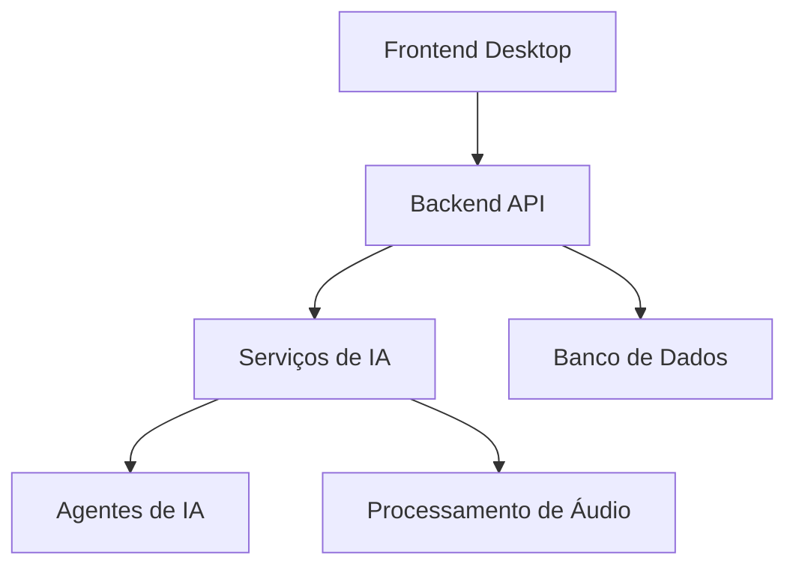

# Especificação Técnica - Sistema Queto

## 1. Introdução

### 1.1 Propósito
O Sistema Queto é uma plataforma de monitoramento e análise de áudio em tempo real, projetada para detectar e gerenciar crises através de análise de voz, texto e emoções usando inteligência artificial.

### 1.2 Escopo
- Monitoramento de áudio em tempo real
- Análise de emoções e sentimentos
- Detecção de palavras-chave
- Geração automática de relatórios
- Gestão de documentos
- Interface desktop para interação com usuário

## 2. Arquitetura do Sistema

### 2.1 Visão Geral


### 2.2 Componentes Principais
1. **Frontend Desktop**
   - Framework: Electron
   - Interface: HTML/CSS/JavaScript
   - Comunicação: Axios para requisições HTTP

2. **Backend API**
   - Framework: FastAPI
   - Python 3.11+
   - RESTful APIs
   - Processamento assíncrono

3. **Serviços de IA**
   - LangChain para orquestração
   - LLaMA/Groq para processamento
   - Modelos de análise de emoções
   - Geração de relatórios

4. **Banco de Dados**
   - SQLite
   - Esquema relacional
   - Armazenamento de documentos e relatórios

## 3. Especificação Técnica Detalhada

### 3.1 Backend (FastAPI)

#### 3.1.1 Endpoints da API
```python
# Áudio
POST /v1/u/process-audio/
POST /v1/u/start-recording
POST /v1/u/stop-recording

# Documentos
GET /v1/u/docs
DELETE /v1/u/docs/{id}
POST /v1/u/docs

# Relatórios
POST /audio/report
GET /reports
```

#### 3.1.2 Estrutura de Dados
```sql
CREATE TABLE documentos (
    id INTEGER PRIMARY KEY AUTOINCREMENT,
    filename TEXT,
    origem TEXT,
    conteudo BLOB NOT NULL,
    timestamp TEXT
);

CREATE TABLE analise_de_documentos (
    id INTEGER PRIMARY KEY AUTOINCREMENT,
    documento_id INTEGER,
    relatorio BLOB NOT NULL,
    timestamp TEXT,
    FOREIGN KEY (documento_id) REFERENCES documentos(id)
);

CREATE TABLE historico_eventos (
    id INTEGER PRIMARY KEY AUTOINCREMENT,
    timestamp TEXT,
    tipo TEXT,
    origem TEXT,
    detalhes TEXT
);
```

### 3.2 Frontend Desktop

#### 3.2.1 Recursos
- Gravação de áudio
- Upload de arquivos
- Visualização de documentos
- Sistema de feedback
- Visualização de relatórios

#### 3.2.2 Interface
```javascript
// Componentes principais
- Navbar
- AudioRecorder
- DocumentViewer
- ReportViewer
- FeedbackForm
```

### 3.3 Processamento de Áudio

#### 3.3.1 Pipeline de Processamento
1. Captura de áudio
2. Conversão para formato WAV
3. Análise de características
4. Detecção de palavras-chave
5. Análise de emoções
6. Geração de relatório

#### 3.3.2 Parâmetros Técnicos
- Taxa de amostragem: 44.1kHz
- Formato: WAV PCM
- Canais: Mono
- Bits por amostra: 16-bit

### 3.4 Sistema de IA

#### 3.4.1 Agentes
1. **Agente de Emoções**
   - Análise de sentimentos
   - Classificação de emoções
   - Pontuação de intensidade

2. **Agente de Análise de Risco**
   - Detecção de palavras-chave
   - Classificação de severidade
   - Análise de contexto

3. **Agente de Planejamento**
   - Geração de planos de ação
   - Priorização de tarefas
   - Recomendações

#### 3.4.2 Modelos e Algoritmos
- LLaMA para processamento de linguagem natural
- Classificadores de emoções
- Algoritmos de processamento de áudio
- Monte Carlo para simulações

## 4. Requisitos de Sistema

### 4.1 Hardware
- CPU: 4+ cores
- RAM: 8GB mínimo
- Armazenamento: 10GB disponível
- Microfone compatível

### 4.2 Software
- Python 3.11+
- Node.js 14+
- SQLite 3
- Drivers de áudio atualizados

### 4.3 Dependências
```python
# Backend
fastapi
uvicorn
langchain
scipy
sounddevice
sqlite3

# Frontend
electron
axios
recorder.js
```

## 5. Segurança e Performance

### 5.1 Segurança
- Autenticação de usuários
- Criptografia de dados sensíveis
- Validação de entrada
- Logs de auditoria

### 5.2 Performance
- Processamento assíncrono
- Caching de resultados
- Otimização de consultas
- Compressão de dados

## 6. Manutenção e Monitoramento

### 6.1 Logs
- Logs de sistema
- Logs de aplicação
- Logs de erro
- Métricas de performance

### 6.2 Backup
- Backup automático do banco
- Versionamento de código
- Backup de configurações

## 7. Integração e Deployment

### 7.1 Ambiente de Desenvolvimento
```bash
# Backend
python -m venv .venv
source .venv/bin/activate
pip install -r requirements.txt

# Frontend
npm install
npm start
```

### 7.2 Deployment
1. Configuração de ambiente
2. Instalação de dependências
3. Configuração de banco de dados
4. Inicialização de serviços

## 8. Considerações Futuras

### 8.1 Escalabilidade
- Suporte a múltiplos usuários
- Distribuição de carga
- Cache distribuído
- Processamento paralelo

### 8.2 Melhorias Planejadas
- Interface web
- Suporte a mais formatos de áudio
- APIs públicas
- Integração com outros sistemas

## 9. Apêndices

### 9.1 Glossário
- **LLM**: Large Language Model
- **PCM**: Pulse-Code Modulation
- **WAV**: Waveform Audio File Format

### 9.2 Referências
- FastAPI Documentation
- Electron Documentation
- LangChain Documentation
- SQLite Documentation

## Esta especificação técnica fornece uma visão detalhada do sistema, incluindo arquitetura, componentes, requisitos e considerações técnicas. 